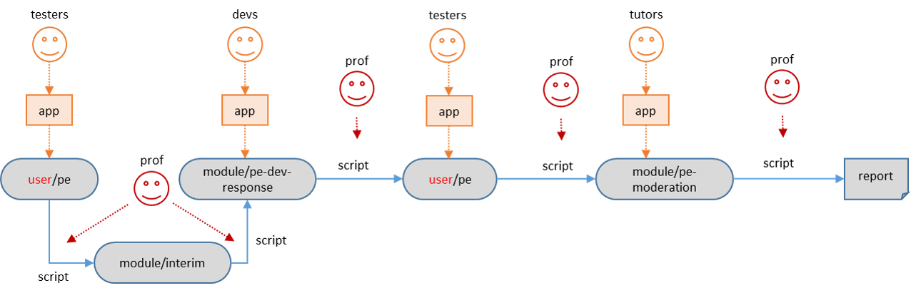

# Issue Templates



## Bug Reporting Phase

### [Script `S0`] Check for repo existence

* Check if the required repo exists in each student's GitHub account
* Email the student if it doesn't exist
* Email account username/password to be taken as parameters

### [App] Collect Bug Reports

* Title and body as the tester entered.
* Labels: `severity.*`, `type.*` (both compulsory)

### [Script `S1a`] Tester-Repo → Interim-Repo

**Note: issue title remains the same as the original issue, throughout the workflow**

Issue body:
```
{original issue description}

<hr>
<sub>[original: username/interim-repo-name#issue-number]</sub>
```
Example:

>The app doesn't work
>
><hr>
><sub>[original: johnDoe/pe#1234]</sub>

Notes:
* Only open issues are to be transferred.
* Copy the `severity.*` label. If no severity label, apply `severity.Low`
* Copy the `type.*` label.
* Transfer image files to the settings repo (public) and update the link in the issue body.
* Check the timestamp. Only bugs reported within the PE period should be transferred. Add a comment to issues falling outside the accepted time window.
  >Bug report not accepted as it was modified outside the time window `{start time}-{end time}`


### [Script `S1b`] Interim-Repo → Dev-Repo

Body:
```
{issue description: same as interim}

<hr>
<sub>[original: module-org/interim-repo-name#issue-number]</sub>
```

Notes:
* Copy all labels
* Apply the correct `tutorial.*` label and `team.*` label to indicate the receiving team


### [Script `S1c`] In the dry run: Tester-Repo → Team-Repo

* Transfer the bug report to the respective team repo.
* Labels are to be omitted.
* Image links can be kept as they are


## Dev Response Phase

### [App] Collect Dev Response

Body:
```
{same as interim repo}
```
Add a comment:
```
# Team's Response

{team's response}

## Duplicate status (if any):
Duplicate of #{issue-number}
```
Example:

># Team's Response
>Yes, we missed this.
>But it's a minor bug.
>
>## Duplicate status (if any):
>Duplicate of #1234

Labels: `severity.*`, `type.*`, `response.*`, `duplicate`

### [Script `S2`] Dev-Repo → Tester-Repo

Add a comment to the original issue in `tester/repo-name`, in the following format:

```
# Team's Response

{team's response}

# Items for the Tester to Verify
## :question: {type of verification}

{description}

- [ ] I disagree

**Reason for disagreement:**
[replace this with your reason]

-------------------
```
Example:

># Team's Response
>
>Description of team's response
># Items for the Tester to Verify
>## :question: Issue response
>
>Team chose `Rejected`.
>
>- [ ] I disagree
>
>**Reason for disagreement:**
>[replace this with your reason]
>
>-------------------
>## :question: Issue severity
>
>Team chose `Low`.
>
>Originally `High`.
>
>- [ ] I disagree
>
>**Reason for disagreement:**
>[replace this with your reason]
>
>-------------------
>## :question: Issue type
>
>Team chose `DocumentationBug`.
>
>Originally `FunctionalityBug`.
>
>- [ ] I disagree
>
>**Reason for disagreement:**
>[replace this with your reason]
>
>-------------------

Notes:
* If the issue is a duplicate, it should be considered as using severity, type, and response from the "original" issue.
* If the dev response contains images, they need to be transferred to the settings repo as well
* How to find the original issue? embed an encrypted string in the issue? Alternatively, can trace back via the interim repo.

## Tester Response Phase

### [App] Collect Tester Response

Update the comment. Example:

>## :question: Issue type
>
>Team chose `DocumentationBug`.
>
>Originally `FunctionalityBug`.
>
>- [x] I disagree
>
>**Reason for disagreement:**
>It's a bug, not a typo.
>
>-------------------

### [Script `S3`] Tester-Repo → Tutor-Repo

Body:
```
# Issue Description
{original issue description}

# Team's Response
{team's response}

# Disputes

## :question: {type of verification}

### Team says:
{team's justification}

### Tester says:
{tester's objection}

```

Example:
>...
># Disputes
>## :question: Issue severity
>### Team says:
>Yes, we missed this.
>But it's a minor bug.
>### Tester says:
>I think it should be medium.
>Most users are affected.

* Labels to be copied from the dev-response repo: `type`, `severity`, `response`, `tutorial`, `team`
* The script will also generate a label based on the number of Disputes (e.g `pending.2` for issue with two disputes)

## Moderation Phase

### [App] Collect Tutor Response

* Show ticks for each dispute
* Add a comment to record tutor response
```
# Tutor Moderation

## {type of verification}

{tutor explanation}
```
Example:
># Tutor moderation
>## :question: Issue severity 
>- [x] Done
>
>I think it is justified.
>## :question: Issue type 
>- [x] Done
>
>Not justified. I've changed it back.

* Allow tutor to change other labels
* The `pending.x` label will be removed if all tasks are done
* Allow adding an `Unsure` label, in case the tutor is unsure about the decision
